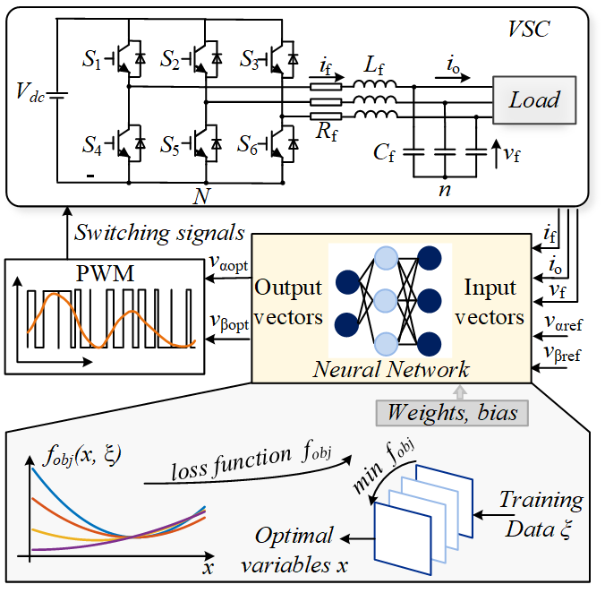

# DPC4PowerElectronics
Differential predictive control for power electronics

This repository provides an implementation of **Differentiable Predictive Control (DPC)**, a control framework that combines predictive control techniques with differentiable optimization. DPC enables seamless integration of predictive models into end-to-end learning pipelines, making it suitable for adaptive control tasks that demand real-time learning and responsiveness.

# Key Features
**End-to-End Differentiability:** Enables optimization-based control directly within deep learning architectures, allowing for more efficient training and tuning.

**Flexible Model Integration:** Supports various differentiable models, including neural networks, state-space models, and other system dynamics representations.

# Project Overview
In this study, we apply the DPC algorithm to a **Voltage Source Converter (VSC)**, demonstrating its effectiveness in controlling power electronics. The DPC approach learns from a single-prediction horizon explicit model predictive control algorithm, optimizing control outputs adaptively to achieve desired system performance.

# System Diagram
The diagram below illustrates the workflow of the DPC training process and provides a system overview:

# Repository Structure
/docs: Contains documentation and technical explanations of the DPC algorithm and its applications.

/src: Source code implementing the DPC algorithms, utilities, and related functions.

/data: Datasets used for training and testing the DPC on power electronic systems.

/tests: Unit tests for validating algorithm stability and accuracy.

/examples: Practical examples and use-case scenarios demonstrating DPC applications in power electronics.
